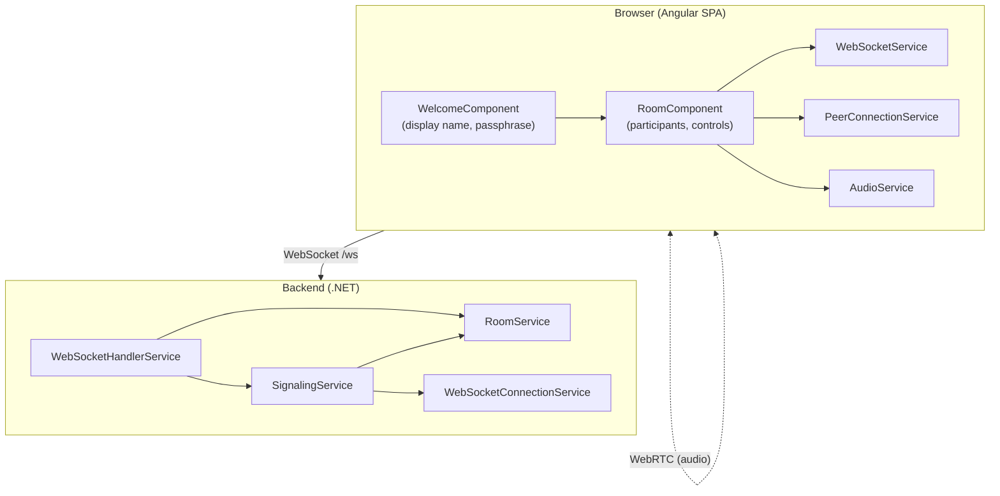
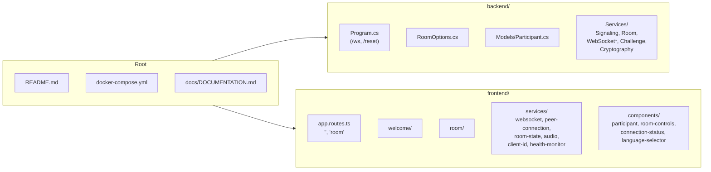
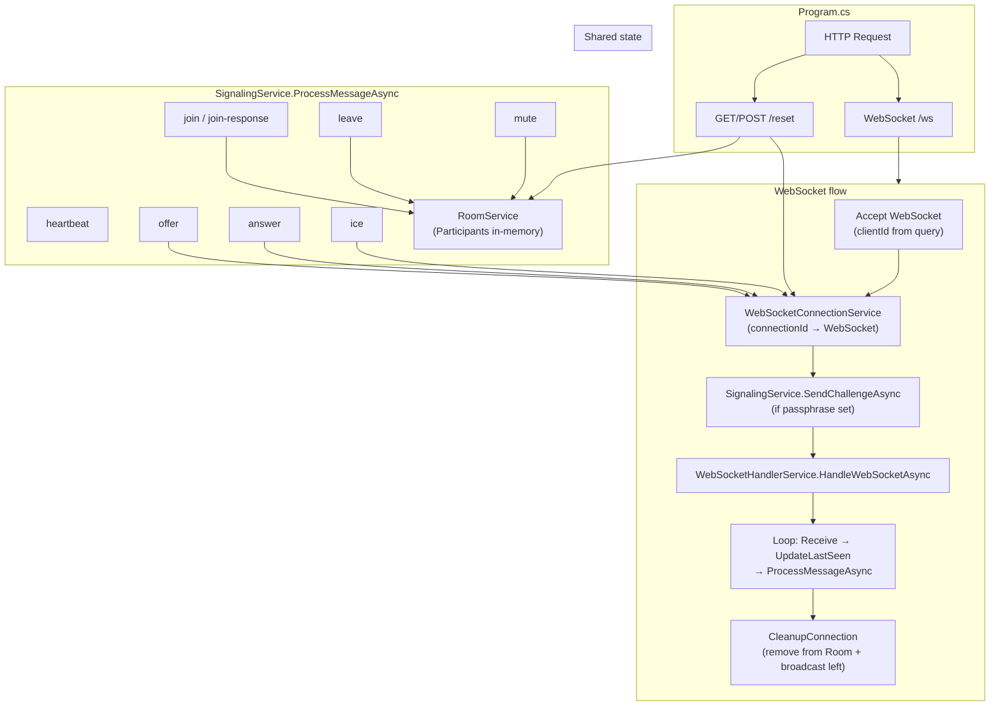
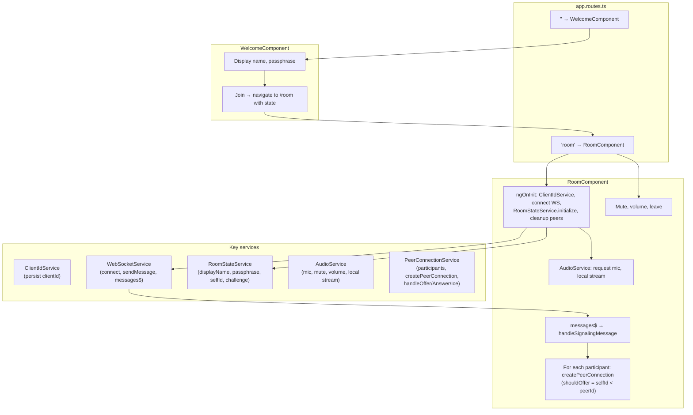
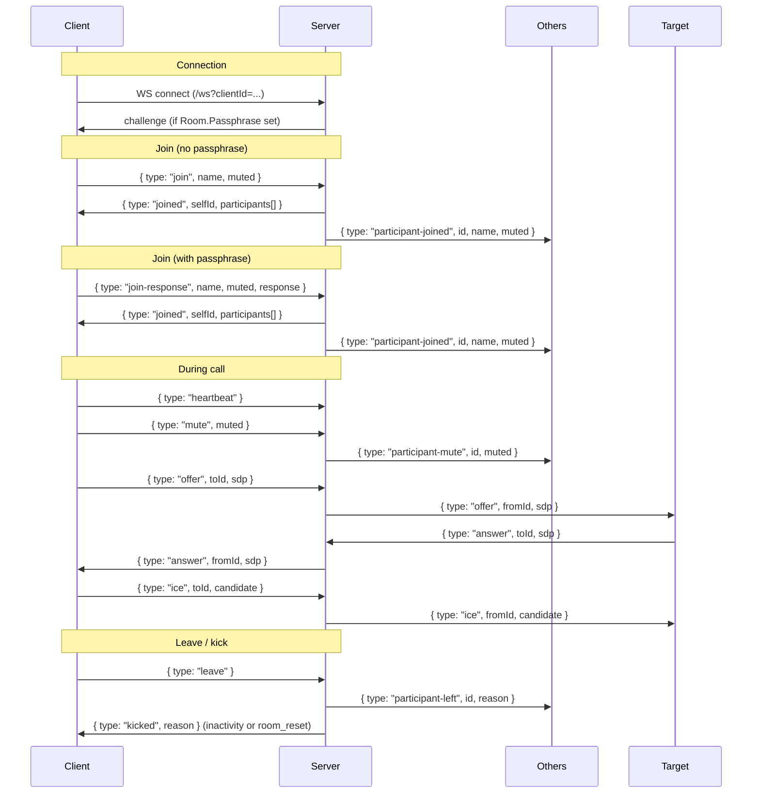
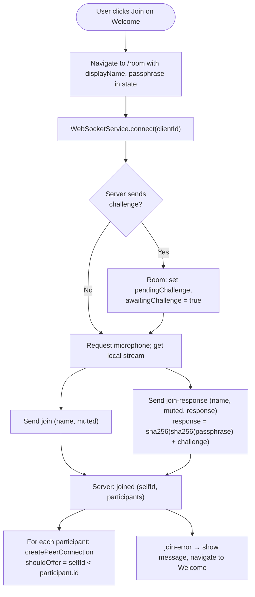
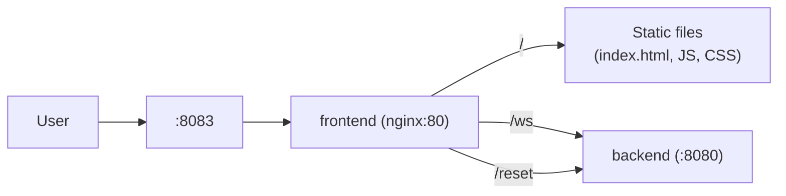

# Defender.ChatRoom — Project Documentation

This document describes the project structure, architecture, and main flows so that the next chat (or developer) can understand the system quickly.

**For a super-detailed guide** (file-by-file reference, config, protocol, task locations), see **[PROJECT_GUIDE.md](PROJECT_GUIDE.md)**.

---

## 1. Project Overview

**Defender.ChatRoom** is a minimal, self-hosted **audio-only group call** web application. It uses a single shared room, no authentication or database, WebSocket for signaling, and WebRTC for peer-to-peer audio (mesh topology).

| Aspect | Description |
|--------|-------------|
| **Frontend** | Angular 18, TypeScript, standalone components |
| **Backend** | .NET 8 Minimal API, WebSockets |
| **Signaling** | JSON over WebSocket (`/ws`) |
| **Media** | WebRTC mesh (each participant has a direct connection to every other) |
| **Deployment** | Docker Compose (nginx + backend), port 8083 |

---

## 2. High-Level Architecture



- **Browser**: Angular app; user enters room from Welcome, then Room handles WebSocket + WebRTC.
- **Backend**: Accepts WebSocket at `/ws`, routes messages through `WebSocketHandlerService` → `SignalingService`; maintains room state in `RoomService` and connections in `WebSocketConnectionService`.
- **Audio**: Flows directly between browsers (WebRTC); server only relays signaling (offer/answer/ICE).

---

## 3. Repository Structure



| Path | Purpose |
|------|--------|
| `backend/` | .NET 8 app: WebSocket endpoint `/ws`, optional passphrase, room state, signaling. |
| `backend/Services/` | `SignalingService`, `RoomService`, `WebSocketHandlerService`, `WebSocketConnectionService`, `WebSocketMessageService`, `ChallengeService`, `CryptographyService`. |
| `frontend/src/app/` | Angular app: routes `''` → Welcome, `room` → Room. |
| `frontend/.../services/` | WebSocket, peer connections, room state, audio, client ID, health monitor. |
| `frontend/.../components/` | Participant tile, room controls, connection status, language selector. |
| `docker-compose.yml` | Frontend (nginx on 8083), backend (internal 8080); nginx proxies `/ws` and `/reset` to backend. |

UI strings are in `frontend/src/app/services/translation-loader.service.ts` (inline `translations` per language; keys: `welcome.*`, `room.*`).

---

## 4. Backend Architecture



- **Entry**: `Program.cs` maps `/ws` (WebSocket) and `/reset` (HTTP). Optional `clientId` in query; otherwise server generates a GUID.
- **Per connection**: Add to `WebSocketConnectionService`, send challenge if passphrase is configured, then run `WebSocketHandlerService` (receive loop, heartbeat, inactivity). On close/error, `CleanupConnection` removes from `RoomService` and broadcasts `participant-left`.
- **Signaling**: All JSON message types (`join`, `join-response`, `leave`, `heartbeat`, `mute`, `offer`, `answer`, `ice`) are handled in `SignalingService`; room state in `RoomService`, forwarding to specific clients via `WebSocketConnectionService`.

---

## 5. Frontend Architecture



- **Welcome**: Collects display name and optional passphrase; navigates to `/room` with `history.state`.
- **Room**: On init, gets stable `clientId`, connects WebSocket, initializes room state, cleans up previous peer state. Subscribes to `WebSocketService.messages$` and handles all signaling (joined, participant-joined/left/mute, offer/answer/ice, challenge, join-error, kicked). Creates one RTCPeerConnection per other participant; “offerer” is chosen by `selfId < peerId`. Audio is managed by `AudioService` and `PeerConnectionService`.

---

## 6. WebSocket Message Flow (Signaling)

All messages are JSON with a `type` field. Direction: **Client → Server** or **Server → Client**.



| Message | Direction | Purpose |
|---------|-----------|--------|
| `challenge` | S→C | Send one-time challenge when passphrase is set. |
| `join` | C→S | Join room (no passphrase). |
| `join-response` | C→S | Join with passphrase proof: `sha256(sha256(passphrase) + challenge)`. |
| `joined` | S→C | Confirm join; includes `selfId` and current `participants`. |
| `join-error` | S→C | Invalid passphrase or missing challenge. |
| `participant-joined` | S→C | New participant; others create peer connection. |
| `participant-left` | S→C | Someone left; remove peer. |
| `participant-mute` | S→C | Mute state change. |
| `offer` / `answer` / `ice` | C↔S | Relayed to `toId`/`fromId` for WebRTC. |
| `heartbeat` | C→S | Keep-alive; server updates `LastSeen`. |
| `kicked` | S→C | Inactivity or room reset. |

Server also sends raw text `ping`; client replies with `pong`. Inactivity is enforced server-side using `LastSeen` and `RoomOptions.InactivityMinutes`.

---

## 7. Join Flow (With and Without Passphrase)



- **No passphrase**: After WS connect, client gets mic, then sends `join`. Server responds with `joined`; client creates peer connections for existing participants and reacts to `participant-joined` for new ones.
- **With passphrase**: Server sends `challenge` after connect. Client stores it, gets mic, then sends `join-response` with `response = sha256(sha256(passphrase) + challenge)`. Server validates and sends `joined` or `join-error`.

---

## 8. WebRTC Peer Connection Flow (Mesh)

Each participant maintains one `RTCPeerConnection` per other participant. Offerer is chosen by string comparison of IDs to avoid duplicate offers.

```mermaid
sequenceDiagram
    participant A as Client A (offerer)
    participant S as Server
    participant B as Client B (answerer)

    Note over A,B: A and B learn each other from "joined" or "participant-joined"
    Note over A: A creates RTCPeerConnection for B, creates offer
    A->>S: { type: "offer", toId: B, sdp }
    S->>B: { type: "offer", fromId: A, sdp }

    Note over B: B creates RTCPeerConnection for A (if needed), setRemoteDescription, create answer
    B->>S: { type: "answer", toId: A, sdp }
    S->>A: { type: "answer", fromId: A, sdp }
    A->>A: setRemoteDescription(answer)

    Note over A,B: ICE candidates (may be multiple)
    A->>S: { type: "ice", toId: B, candidate }
    S->>B: { type: "ice", fromId: A, candidate }
    B->>B: addIceCandidate
    B->>S: { type: "ice", toId: A, candidate }
    S->>A: { type: "ice", fromId: B, candidate }
    A->>A: addIceCandidate

    Note over A,B: WebRTC connection established; audio flows P2P
```

- **Offerer**: `RoomComponent` calls `createPeerConnection(remoteId, ..., shouldOffer: true)`. `PeerConnectionService` creates `RTCPeerConnection`, adds local audio track, creates offer, sets local description, sends `offer` via WebSocket.
- **Answerer**: On receiving `offer`, Room ensures a participant entry and `RTCPeerConnection` for `fromId` (creating one if needed with `shouldOffer: false`), then `handleOffer(fromId, sdp, sendMessage)`: setRemoteDescription(offer), createAnswer, setLocalDescription, send `answer`.
- **ICE**: Both sides send `ice` messages with candidates; server relays by `toId`/`fromId`. Recipient calls `addIceCandidate`.
- **STUN**: Configured in frontend [PeerConnectionService](frontend/src/app/services/peer-connection.service.ts) (e.g. `stun:stun.l.google.com:19302`) for NAT traversal.

---

## 9. Deployment (Docker)



- **docker-compose**: `frontend` exposes 8083, serves static assets and proxies `/ws` and `/reset` to `backend:8080`.
- **Backend**: Listens on `http://0.0.0.0:8080`; no direct exposure to host unless you map ports.
- **Config**: Room options (e.g. passphrase, inactivity, heartbeat) via `appsettings.json` or environment variables (`Room__Passphrase`, etc.). `/reset` requires passphrase to be set and accepts it in query or JSON body; it disconnects all clients and clears `RoomService`.

---

## 10. Summary for Next Chat

- **What it is**: Single-room audio-only call app; WebSocket for signaling, WebRTC mesh for audio.
- **Backend**: .NET 8, `/ws` and `/reset` in `Program.cs`; `SignalingService` + `RoomService` + `WebSocketConnectionService` are the core.
- **Frontend**: Angular 18; Welcome → Room; `WebSocketService` + `PeerConnectionService` + `RoomStateService` + `AudioService` drive the room and peers.
- **Join**: Optional passphrase with challenge/response (SHA-256); then `join` or `join-response` → `joined` → peer list and WebRTC setup.
- **WebRTC**: One peer connection per other participant; offer/answer/ICE relayed through server; offerer determined by `selfId < peerId`.
- **Deploy**: Docker Compose; nginx on 8083, backend on 8080 internally; nginx proxies `/ws` and `/reset`.

### Where to look for common tasks

- **Join / passphrase**: Backend [SignalingService](backend/Services/SignalingService.cs) (`HandleJoinAsync`, `HandleJoinResponseAsync`, `CompleteJoinAsync`); frontend [RoomComponent](frontend/src/app/room/room.component.ts) (`handleSignalingMessage` for `joined` / `join-response`, `sendJoinMessage`, `sendJoinResponse`).
- **Signaling message handling**: Backend [SignalingService](backend/Services/SignalingService.cs) `ProcessMessageAsync`; frontend [RoomComponent](frontend/src/app/room/room.component.ts) `handleSignalingMessage`.
- **WebRTC**: Frontend [PeerConnectionService](frontend/src/app/services/peer-connection.service.ts) (create, offer/answer/ICE); backend only relays in [SignalingService](backend/Services/SignalingService.cs).

Use this doc plus the README (config, quick start, limitations) to extend or debug the project.
